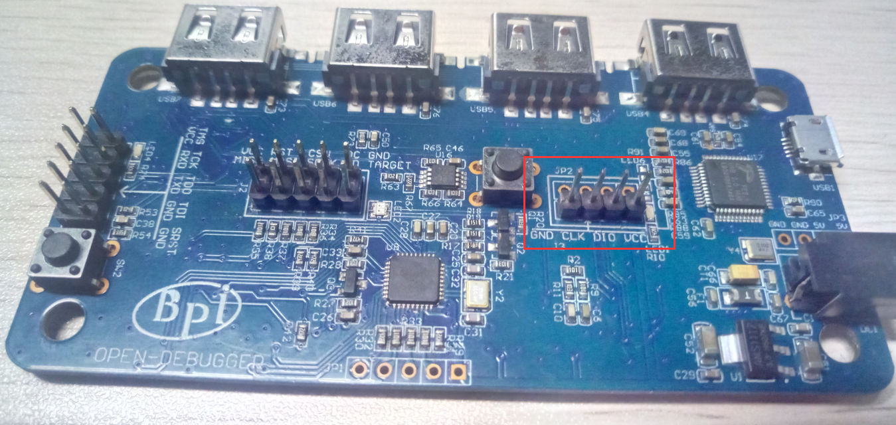
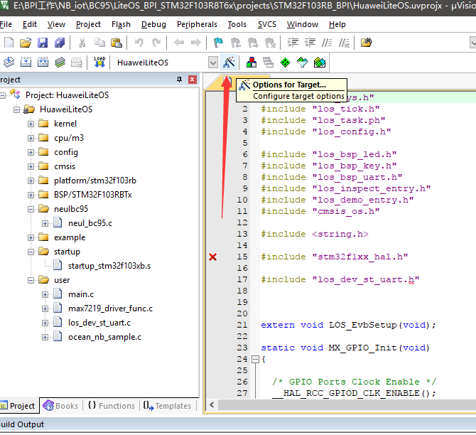

# 使用Open Debugger烧录BPI-NB_IoT开发板

- 硬件连接：

 将图中的接口使用杜邦线与BC95板子上的SWD烧录接口对应链接

然后将open debugger使用MicroUSB线链接至电脑。

- 软件设置：

（使用的环境：IDE MDK5  debugger驱动Jlink V4.96b）

安装好IDE与debugger驱动后，打开IDE做如下设置
 
1. 打开Options of Target设置界面

2.	切换至debug选项卡，然后选择烧录器为Jlink/J-TRACE Cortex

3.	进入到烧录器设置

需要更改的就是Port栏里面修改为SW（其对应的SWD烧录模式），后面的速度5M or 10M（可以Auto Clk，但是这两个是比较常用稳定的速度）如果硬件连接ok的在选择SW模式后右边的SW Device下面可以看到有一个Devcie并且具有IDCODE。

然后我们点击确定就OK。设置部分全部完成，开始编译程序进行烧录。
