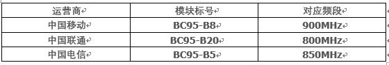

# BPI NB-IoT Linaro简易使用说明

- ## MCU部分

MCU：STM32F103RCT6（IDE内芯片选型）

供电方式：MicroUSB（常用） 或者3.7v 锂电

调试工具：IDE（MDK5&STM32F1xx扩展包或其他） J-Link仿真器  四或五条杜邦线板子硬件设计固定为SWD调试模式，不能使用串口下载。

仿真器接线：

JLink与BPI NB-IoT Linaro采用SWD模式连接对应接口：

MDK5内仿真器DeBug设置：

首先需要根据对影心片建立工程文件，并在Options of Target中做如下设置

（工程文件具体设置情况包括但不仅限于以下设置）

（此时板子需要供电）

**调试方法：**

1. 可以使用调试串口（MCU USART1）来进行调试。

2. 使用MicroUSB虚拟串口进行调试。

以上两种方式均需要MCU编程达到。

**备注：**

1. 调试串口、SWD仿真接口间距2.54mm，GPIO间距2.0mm

2. 靠近MicroUSB的LED是电源指示灯，任意方式正确通电后应该常亮。

- ## NB-IoT部分

模块型号：移远BC95

该模块需要配合专用NB_IOT SIM卡使用。国内三个运营商所对应的频段不同，模块可使用的运营商也不同。具体可以根据模块标号来辨认。

##### 固件版本：

查询固件的指令：AT+CGMR。

会返回V100R100C10B656SP2这样的版本号，其版本为656SP2，这个版本固件扰码需要对应基站也开启扰码功能。

##### SIM卡：

本模块可以使用两种SIM卡形式：插入式SIM卡或芯片是eSIM卡

两种SIM卡均可正常使用,但不可同时使用。

##### 天线：

模块留有MHF WiFi天线接口，可以根据产品实际使用情况选装。
